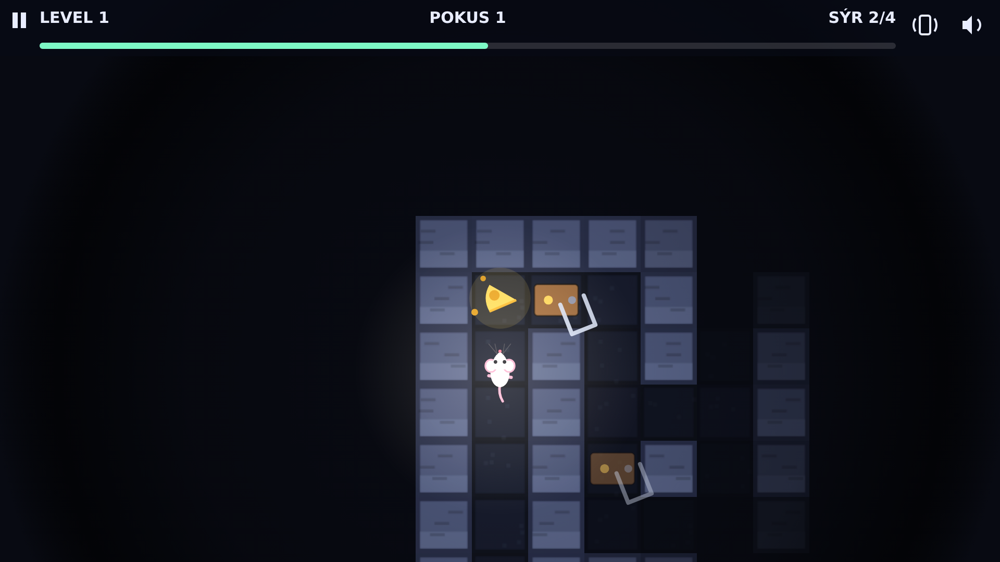
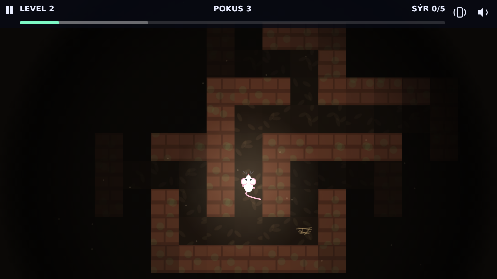
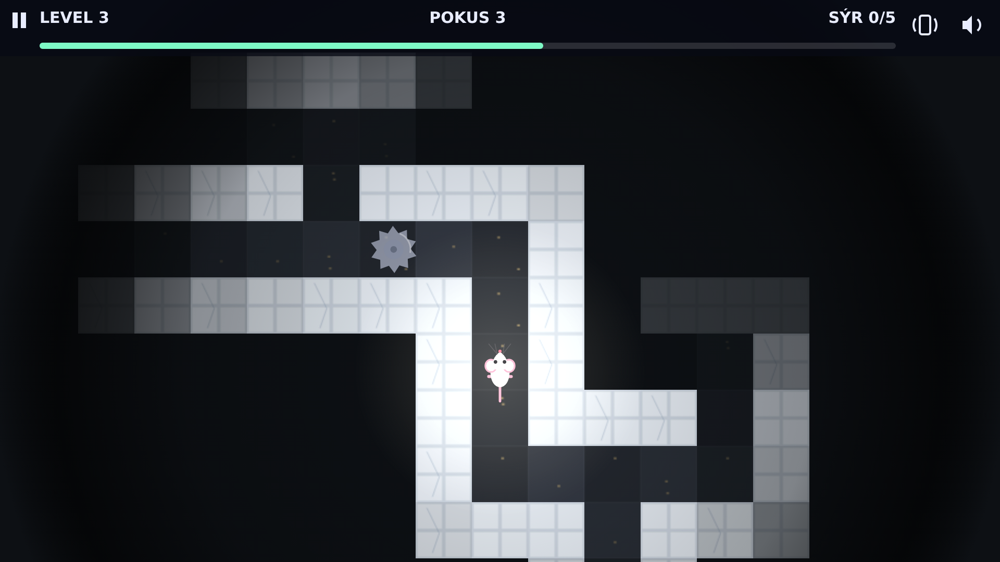
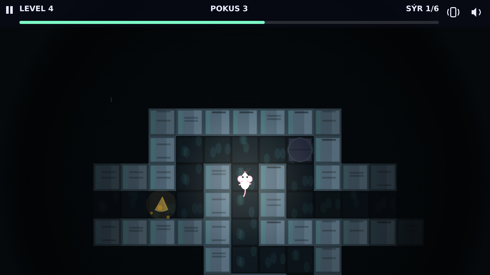

# Labyrint

Bílá myš utíká ze středu labyrintu ven. Běží sama, ty jí říkáš jen kudy –
a labyrint se pod ní otáčí, protože myš míří vždycky vzhůru.



Celá hra je jeden soubor `index.html`, jedno `<canvas>` a pár ES modulů.
Žádný framework, žádné závislosti, žádný build krok – stačí ji hostovat jako
statické soubory. Jde nainstalovat na plochu telefonu a hrát offline.

## Jak se to hraje

Myš vyběhne z doupěte uprostřed labyrintu a hledá jediný východ v obvodové zdi.
Vidí přitom jen kousek chodeb kolem sebe – co je za rohem, zjistí, až tam
doběhne. Cestou se dá posbírat sýr, ale k útěku ho potřeba není.

| Co chceš | Klávesnice | Dotyk a myš |
| --- | --- | --- |
| zahnout doleva | `←` / `A` | levý kraj obrazovky |
| zahnout doprava | `→` / `D` | pravý kraj obrazovky |
| otočit se zpátky | `mezerník` / `↓` / `S` | střed obrazovky |
| pauza | `Esc` / `P` | horní pruh |
| zkusit znovu | `R` | – |
| zvuk / vibrace | `M` / `H` | ikony v pravém rohu |

Zatáčení je **relativní k myši**: labyrint se otáčí jako mapa v navigaci, takže
„doleva“ znamená doleva pořád, ať už myš běží kamkoliv. Zeď myš nezabije, jen se
o ni zapře – a otočka na místě je zároveň jediný způsob, jak před pastí počkat
na správnou chvíli.

## Co v labyrintu číhá

- **Sklapovačky** cvakají podle hodin, ne podle myši. Než sklapnou, pružina se
  chvěje – dá se to přečíst a proběhnout mezi tím.
- **Propadla** v podlaze se cyklicky otevírají. Před otevřením víko vrže.
- **Pily** jezdí sem a tam po krátkém úseku chodby. Kolem každé vede i jiná
  cesta, takže se dají obejít – nebo přeběhnout, když zrovna odjedou.
- **Kočky** hlídkují labyrintem a co uvidí rovnou chodbou, to honí. Jsou
  pomalejší než myš a vidí kratší kus chodby, takže se jim dá utéct – ale
  ne do slepé uličky.

## Světy

Deset labyrintů, čtyři prostředí, a každé má vlastní vzhled i hudbu. Střídají se
od začátku, takže žádná část hry nevypadá dlouho stejně.

| | |
| --- | --- |
|  |  |
| **Sklep** – cihly, udusaná hlína a prach ve vzduchu | **Kuchyň** – kachlíky, drobky a nejvíc sklapovaček |
|  |  |
| **Kanál** – beton, voda u stěn a kapky ze stropu | **Katakomby** – kámen a tma, se kterou hra začíná |

## Spuštění

ES moduly se přes `file://` nenačtou, takže je potřeba statický server:

```bash
python3 -m http.server 8000   # a pak http://localhost:8000
```

Nebo přes Docker:

```bash
docker compose up
```

## Jak vznikají labyrinty

Mapy negeneruje náhoda, ale `tools/gen_mazes.py`: vyhloubí labyrint, probourá
pár zdí navíc (aby vedla víc než jedna cesta), prorazí východ co nejdál od
doupěte, rozmístí nástrahy – a pak **simulací ověří, že se level dá projít**.
Když neprojde, nic se nezapíše.

```bash
python3 tools/gen_mazes.py           # přegeneruje js/levels/*.js
python3 tools/gen_mazes.py --check   # jen ověří, nic nezapíše
node tools/playtest.mjs              # projde všech 10 levelů v Chromiu
```

Playtest hru opravdu hraje: pustí ji v prohlížeči a odehraje autopilotem, který
drží nejkratší cestu k východu, před zavřenou pastí počká a pile s kočkou uhne.
Je to zároveň kontrola, že si kód hry a simulace v generátoru odpovídají.

## Licence

MIT – viz [LICENSE](LICENSE).
